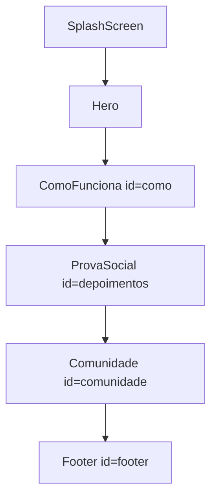

# Landing Page — Espanhol das Ruas

Documentação da estrutura e comportamento da landing em produção.

---

## Fluxo da página



A splash screen exibe por ~1,25s (logo pulsando + barra de progresso) antes de montar o restante da página.

---

## Seções

| Ordem | Componente | ID âncora | Descrição |
|---|---|---|---|
| — | `SplashScreen` | — | Tela de carregamento inicial |
| 1 | `Nav` | — | Navbar fixa com blur |
| 2 | `Hero` | `hero` | Cartaz noturno — H1 "DE ZERO A HABLANTE" |
| 3 | `ComoFunciona` | `como` | Três pilares do método |
| 4 | `ProvaSocial` | `depoimentos` | Depoimentos de membros |
| 5 | `Comunidade` | `comunidade` | Banner Discord com ticker e feed |
| 6 | `Footer` | `footer` | Logo, links, CTA final |
| — | `BackToTop` | — | Botão fixo após scroll |

---

## Navegação

### Navbar e footer (mesma ordem)

| Label | Destino |
|---|---|
| Como funciona | `#como` |
| Planos | `#footer` |
| Depoimentos | `#depoimentos` |
| Discord | `#comunidade` |

### CTAs "Entrar na comunidade"

Abrem o convite do Discord em nova aba. URL centralizada em [`src/lib/constants.ts`](../src/lib/constants.ts):

```ts
export const DISCORD_INVITE_URL = 'https://discord.gg/RhSt3uBQS'
```

Presentes em: Nav, Hero, Comunidade, Footer.

### Hero — botão secundário

"Ver como funciona →" aponta para `#como`.

---

## Animações

| Elemento | Comportamento |
|---|---|
| Splash | Logo pulsando + progressbar 1,25s → fade-out |
| Nav | Fade + slide de cima (`nav-reveal`) |
| Hero conteúdo | Fade escalonado (`hero-reveal`), delay 80ms entre itens |
| Hero logo desktop | Fade-in + floating leve contínuo |
| Hero logo mobile | Fade faint atrás do texto (wrapper centralizado) |
| Skyline | Sem animação — opacidade fixa 0.6 |
| Comunidade ticker | Conta até 300 quando entra no viewport (IntersectionObserver) |
| Comunidade feed | Rotaciona mensagens só com seção visível |
| Back to top | Aparece após ~320px de scroll |

Respeitar `prefers-reduced-motion`: animações desabilitadas em `.hero-reveal`, `.nav-reveal` e floating.

---

## Estrutura de arquivos relevante

```
src/
  App.tsx              # Orquestra splash + seções
  index.css            # Tokens + componentes CSS
  lib/constants.ts     # URL do Discord
  components/
    Nav.tsx
    Hero.tsx
    ComoFunciona.tsx
    ProvaSocial.tsx
    Comunidade.tsx
    Footer.tsx
    SplashScreen.tsx
    BackToTop.tsx
    ui/                # Button, Logo, Eyebrow, Proof, Skyline
public/
  assets/
    simbolo.svg
    skyline.svg
```

---

## Responsivo — pontos de atenção

- **Nav:** links ocultos em `< 768px`, só logo + CTA
- **Hero:** símbolo lateral só desktop; mobile usa logo faint centralizada
- **Comunidade:** grid 2 colunas → 1 coluna em `≤ 1023px`
- **Footer:** 3 colunas → empilhado no mobile
